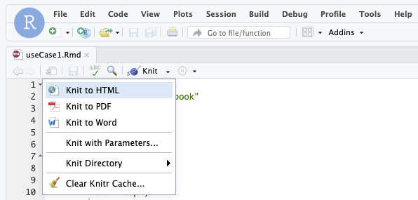

# iLincs API useCases

## Prerequisites

To execute the code in the useCase notebooks, please install RStudio, launch RStudio and install following R packages: knitr, tinytex, httr, jsonlite, htmltools. 

```R
install.packages(c("knitr", "tinytex", "httr", "jsonlite", "htmltools"))
```

## Use Cases


|               | R Markdown source  | PDF/HTML output  | Web walkthrough |
| ------------- |:------------------:|:----------------:|:---------------:|
| <details><summary><b>useCase1</b></summary>Identifying chemical perturbagens<br>emulating genetic perturbation of MTOR protein</details>  | [useCase1.Rmd](../../../blob/master/useCases/useCase1.Rmd) | [PDF](https://github.com/uc-bd2k/ilincsAPI/blob/master/useCases/useCase1.pdf) / [HTML](http://htmlpreview.github.io/?https://github.com/uc-bd2k/ilincsAPI/blob/master/useCases/useCase1.html) | [link](http://www.ilincs.org/help/useCases/Identifying%20chemical%20perturbagens%20emulating%20genetic%20perturbation%20of%20MTOR%20protein) |
| <details><summary><b>useCase2</b></summary>Mechanism of action analysis via connection<br>to genetic perturbation signatures</details>  | [useCase2.Rmd](../../../blob/master/useCases/useCase2.Rmd) |   [PDF](https://github.com/uc-bd2k/ilincsAPI/blob/master/useCases/useCase2.pdf) / [HTML](http://htmlpreview.github.io/?https://github.com/uc-bd2k/ilincsAPI/blob/master/useCases/useCase2.html) | [link](http://www.ilincs.org/help/useCases/Mechanism%20of%20action%20analysis%20via%20connection%20to%20genetic%20perturbation%20signatures) |
| <details><summary><b>useCase3</b></summary>Proteo-genomics analysis of cancer driver events<br>in breast cancer</details>  | [useCase3.Rmd](../../../blob/master/useCases/useCase3.Rmd) |   [PDF](https://github.com/uc-bd2k/ilincsAPI/blob/master/useCases/useCase3.pdf) / [HTML](http://htmlpreview.github.io/?https://github.com/uc-bd2k/ilincsAPI/blob/master/useCases/useCase3.html) | [link](http://www.ilincs.org/help/useCases/Proteo-genomics%20analysis%20of%20cancer%20driver%20events%20in%20breast%20cancer) |

## Creating Output

After installing the prerequisites and loading Rmd file into RStudio click on "Knit" to create a PDF/HTML/Word output.


